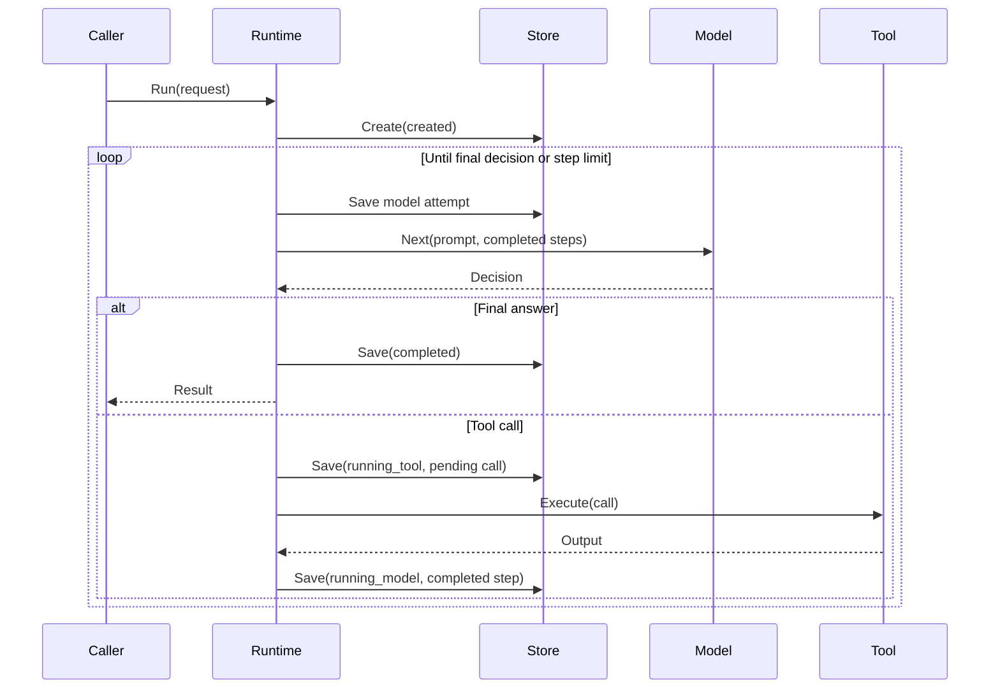

# Agent Harness Runtime

[English](../README.md) | 简体中文

本仓库是一个教学和概念验证项目。它不是生产级 Agent 平台。

这个小型运行时演示模型决策、工具调用、持久恢复边界和终止结果。它关注 Agent API 与底层工具基础设施之间的执行生命周期。

项目将模型提供方、沙箱后端、MCP 传输、调度器和应用编排放在核心状态机之外。

## 状态

`main` 分支已完成 v0.1 的运行时范围：确定性的模型与工具执行、取消语义、持久检查点、安全恢复、本地执行锁、Sandbox 和 MCP 工具适配器、执行观察钩子，以及可运行的 Sandbox 自用验证示例。

v0.2 增加了小型 OpenAI 兼容聊天补全 `Model` 适配器。它还增加了可运行的 DeepSeek → Harness → Sandbox → Docker 自用验证路径、确定性执行评测、持久执行轨迹与生命周期差异、回调期限、有界持久模型重试，以及可选的待处理工具结果核对。这些功能没有改变 Harness 状态机的结构。

如果没有配置检查点存储，运行时默认只在内存中运行。恢复过程显式且保守。系统绝不会自动重放结果不确定的外部工具。可选的核对功能允许工具适配器证明先前调用已经完成。

## v0.1 保证矩阵

| 能力 | v0.1 保证 |
| --- | --- |
| 显式执行生命周期 | 支持，并验证状态转换 |
| 确定性的模型 → 工具 → 模型循环 | 支持 |
| 稳定的工具调用标识 | 支持；不能重复使用已完成的 ID |
| 有界模型尝试预算 | 支持；默认 16 次尝试 |
| 回调后的取消 | 取消优先；不会提交取消后返回的成功结果 |
| 带版本的检查点 | 支持；当前模式版本为 3 |
| 持久的模型尝试预留 | 支持；每次模型回调前预留 |
| 本地崩溃恢复 | 支持；从安全检查点状态恢复 |
| 恢复时重放已完成工具 | 拒绝；复用已完成的结果 |
| 待处理工具恢复 | 失败关闭；除非 `ToolOutcomeReconciler` 能证明原调用已完成 |
| 本地单执行所有权 | 通过 `ExecutionLocker` 支持；`FileStore` 使用 Linux `flock` |
| Sandbox 工具适配器 | 支持 `Agent-Sandbox-Runtime` v0.1.0 |
| MCP 工具适配器 | 支持官方 MCP Go SDK |
| 执行观察钩子 | 支持；尽力交付，并与控制流隔离 |
| 可运行的端到端 Sandbox 示例 | 位于 `examples/sandbox-agent` |
| 外部工具副作用严格执行一次 | 不保证 |
| 自动重放工具 | 不包含 |
| 只读工具结果核对 | `ToolExecutor` 的可选能力 |
| 分布式租约或网络文件系统协调 | 不包含 |
| 调度器、队列或工作器运行时 | 不包含 |
| 多 Agent 编排 | 不包含 |
| 内置真实 LLM 提供方 | 不包含 |

## 执行模型

```text
created
   |
   v
running_model ---------------------> completed
   |
   | tool_call
   v
running_tool
   |
   +-----------------> running_model

running_model / running_tool
   |             |
   +--> failed   +--> cancelled
```

### 执行时序



所有状态转换都显式定义并经过验证。终止状态不能继续转换。

每个模型步骤返回两种决策之一：

- `final`：成功终止并返回输出
- `tool_call`：分派一个带标识的工具调用，取得结果，然后把结构化步骤传给下一次模型调用

每个工具调用都必须有稳定且在本次执行中唯一的调用 ID。重复使用已完成的调用 ID 会在分派前返回 `ErrDuplicateToolCall`，即使调用参数已经改变。运行时在返回结果中记录已完成的工具步骤和完整的状态转换序列。

## 核心 API

```go
runtime, err := harness.New(model, tools)
if err != nil {
    panic(err)
}

result, err := runtime.Run(ctx, harness.Request{
    Prompt: "inspect this repository",
})
```

默认执行上限为 16 次模型尝试。`WithMaxSteps` 可以降低或提高这个上限。用尽已保存的预算后，系统失败关闭并返回 `ErrStepLimitExceeded`。

上下文取消会产生显式的 `cancelled` 终止状态。运行时在模型或工具回调之前和之后立即检查取消状态。因此，取消后才返回的成功回调结果不会写入执行历史或最终输出。模型错误、工具错误、无效模型决策和步骤超限会产生 `failed` 状态。

## OpenAI 兼容 Model 适配器

`OpenAICompatibleModel` 将非流式 `/chat/completions` 端点适配到 Harness 的 `Model` 接口。它只使用 Go 标准库。它支持实现 OpenAI 聊天补全工具调用格式的提供方，包括 DeepSeek。

```go
model, err := harness.NewOpenAICompatibleModel(harness.OpenAICompatibleModelConfig{
    BaseURL: "https://api.deepseek.com",
    APIKey:  os.Getenv("DEEPSEEK_API_KEY"),
    Model:   "deepseek-v4-pro",
    Tools: []harness.OpenAIToolDefinition{{
        Name:        "shell",
        Description: "Run one sandboxed shell command.",
        Parameters:  json.RawMessage(`{"type":"object","properties":{"command":{"type":"string"}},"required":["command"]}`),
    }},
})
```

每次模型尝试时，适配器都将已完成的 Harness 步骤重建为 `assistant tool_call → tool result` 消息。它完整保留提供方的工具调用 ID 和参数字符串。因此，检查点、重复调用和解析器语义仍由现有运行时及工具层管理。

v0.2 的边界有意保持窄小：

- 每次模型尝试只接受一个工具调用；多个工具调用会失败关闭并返回 `ErrModelResponse`
- 不会把令牌截断等非 `stop` 终止原因提交为最终答案
- 提供方 HTTP 错误可归类为 `ErrModelProvider`，并通过 `ModelProviderHTTPError` 提供状态码
- 上下文取消会传递给 HTTP 请求
- 使用 API 密钥时必须使用 HTTPS 端点；密钥只通过 Bearer 授权头发送，绝不会写入检查点
- 带凭据的请求不会跟随 HTTP 重定向，防止 Bearer 令牌被转发或降级传输
- `ExtraBody` 可以增加提供方专用的顶层请求字段，但不能覆盖 `model`、`messages`、`tools` 或 `stream`
- 不包含流式输出、提供方注册表、适配器重试与退避、令牌统计和提供方响应扩展

## 模型重试

自动模型重试默认关闭。`WithModelRetry` 可以启用有界重试预算：

```go
runtime, err := harness.New(
    model,
    tools,
    harness.WithMaxSteps(16),
    harness.WithModelRetry(harness.ModelRetryPolicy{
        MaxRetries: 2,
        Delay:      250 * time.Millisecond,
    }),
)
```

重试只适用于模型回调。工具回调绝不会自动重试，因为失败或超时的工具可能已经产生外部副作用。

### 为什么不重试工具调用

假设有一个 ID 为 `payment-42` 的 `charge_payment` 工具调用：

1. Harness 将 `payment-42` 保存为待处理工具调用。
2. 支付服务向客户收取 10 美元。
3. 支付服务发送成功响应。
4. Harness 收到响应前，网络连接中断。
5. Harness 看到超时，但客户已经完成付款。

自动重试可能再次向客户收取 10 美元。超时只能证明 Harness 没有收到结果。它不能证明工具没有产生副作用。

因此，Harness 保持 `payment-42` 的待处理状态，并且不会再次执行它。恢复时，`ToolOutcomeReconciler` 可以按调用 ID 查询支付服务。只有当查询证明第一次扣款已完成时，执行才会继续。如果结果仍不确定，系统返回 `ErrToolOutcomeUnknown` 并停止恢复。

此规则也适用于电子邮件、文件创建、部署和消息发送。每项操作都可能在响应不可用前完成。

内置分类器会重试 `ErrModelTimeout`、常规提供方传输错误，以及提供方 HTTP 408、429、500、502、503 和 504 错误。`ErrModelResponse`、调用方取消和其他模型错误会立即失败。

每次重试都会消耗普通的 `MaxSteps` 模型尝试预算。系统还会单独持久保存重试预算。因此，崩溃或重启不能重置已经确认的自动重试次数。有关持久计数和恢复边界，请参阅 [MODEL_RETRIES.md](../MODEL_RETRIES.md)。

## 持久检查点

```go
store, err := harness.NewFileStore("./checkpoints")
if err != nil {
    panic(err)
}

runtime, err := harness.New(
    model,
    tools,
    harness.WithCheckpointStore(store),
)
if err != nil {
    panic(err)
}

result, err := runtime.Run(ctx, harness.Request{
    ExecutionID: "research-001",
    Prompt:      "inspect this repository",
})
```

使用 `WithCheckpointStore` 时，调用方必须提供非空的 `ExecutionID`。`Run` 会原子创建初始记录。如果 ID 已存在，它会在调用任何模型或工具前返回 `ErrExecutionExists`。

模式版本 3 记录请求、原始步骤预算、已预留的模型尝试次数、配置和已消耗的自动重试预算、当前结果、状态转换历史、已完成工具步骤、待处理工具调用，以及用于诊断的终止错误文本。

| 保存边界 | 记录的状态 |
| --- | --- |
| 创建执行 | `created`、请求和预算 |
| 每次模型回调前 | `running_model`，增加已预留的模型尝试次数 |
| 可重试模型失败后 | `running_model`，增加持久模型重试次数 |
| 每次工具回调前 | `running_tool`，记录完整的待处理工具调用 |
| 接受或从外部核对工具结果后 | `running_model`，记录已完成步骤并清除待处理调用 |
| 返回终止结果 | `completed`、`failed` 或 `cancelled` |

下一个回调开始前，检查点写入必须成功。存储失败会停止执行并返回 `ErrCheckpointStore`。返回的结果代表最后一次已确认的快照。终止状态写入使用独立的有界上下文。因此，已经取消的执行仍可尝试持久保存取消状态。

`FileStore` 适用于可信的本地 Linux 文件系统。它使用原子文件发布、文件和目录同步、严格文件权限、哈希执行文件名，以及针对每次执行的 `flock` 建议锁。v0.1 不保证分布式租约和网络文件系统协调。

## 恢复

新进程可以打开同一个存储，构建兼容的适配器，然后显式恢复执行：

```go
result, err := runtime.Resume(ctx, "research-001")
```

`Resume` 使用已保存的请求、工具历史、原始模型尝试预算和自动模型重试预算。新的运行时配置不能重置这些持久预算。被中断的模型尝试可能再次调用，因此也可能再次计费。崩溃恢复与自动重试计数相互独立。

| 已保存状态 | 恢复行为 |
| --- | --- |
| `created` | 使用已保存的请求和预算启动模型循环 |
| `running_model` | 使用已保存的工具结果继续执行；预留新的模型尝试 |
| `running_tool` | 查询可选的 `ToolOutcomeReconciler`；只有它证明调用已完成时才继续，否则返回 `ErrToolOutcomeUnknown` |
| `completed` | 返回已保存的结果，不调用回调，也不写入检查点 |
| `failed` / `cancelled` | 返回已保存的结果和 `ErrExecutionTerminal` |

恢复会复用检查点历史中的已完成工具，绝不会再次分派它们。待处理工具调用只记录持久意图。即使结果没有保存，外部操作也可能已经发生。运行时绝不会自动重新执行该调用。

如果 `ToolExecutor` 同时实现 `ToolOutcomeReconciler`，`Resume` 可以查询外部状态。它只接受可以证明已完成的结果。不确定的结果仍会失败关闭并返回 `ErrToolOutcomeUnknown`。

核对完成的结果会转换成普通的已完成 `Step`。系统持久记录 `running_tool → running_model`，并在再次调用模型前保存。核对操作本身必须只读。如果检查点写入失败，可以安全地重复核对。有关接口和失败边界，请参阅 [TOOL_RECONCILIATION.md](../TOOL_RECONCILIATION.md)。

模式版本 2 的记录仍可恢复，但自动模型重试保持关闭。模式版本 1 的记录仍可读取。终止的 v1 记录可以检查或返回。活跃的 v1 执行会返回 `ErrRecoveryUnsupported`，因为这些记录没有持久预留被中断的模型尝试。

## Sandbox ToolExecutor

`SandboxToolExecutor` 将 Harness 的 `ToolExecutor` 接口适配到 `github.com/luojiyin1987/Agent-Sandbox-Runtime` v0.1.0。

调用方提供的 `SandboxRequestResolver` 将面向 Agent 的 `ToolCall` 映射为一个 `sandbox.ExecRequest`。Harness 核心不解释 shell 语法、工作区策略、Docker 或 gVisor 配置。

适配器保留 Sandbox Runtime 接口的语义：

- 无效的解析结果会在分派给沙箱前失败
- 沙箱运行时错误会导致 Harness 工具步骤失败，同时保留错误标识
- 如果 Sandbox Runtime 没有返回 Go 错误，非零退出码仍属于已完成的工具结果
- 面向模型的稳定 JSON 包含退出码、标准输出、标准错误、截断状态和终止原因

## MCP ToolExecutor

`MCPToolExecutor` 使用官方 MCP Go SDK，将 Harness 的 `ToolExecutor` 接口适配到已经建立连接的 MCP 调用方。

适配器将协议和传输生命周期保留在 Harness 核心之外：

- `CallTool` 返回 Go 错误时，Harness 工具步骤失败
- `CallToolResult.IsError=true` 会作为工具级结果传给下一次模型调用，使模型可以自行修正
- 尚未解决的 `input_required` 状态会被拒绝，并返回 `ErrMCPInputRequired`
- stdio/HTTP 传输设置、身份验证、服务器发现、重连和 MCP 会话所有权由调用方负责

## 可观察性

`WithObserver` 安装一个同步、尽力交付的执行边界观察器：

```text
execution_started
model_started
model_completed
tool_started
tool_completed
execution_completed | execution_failed | execution_cancelled
```

事件提供执行 ID、生命周期状态、模型尝试次数、工具标识、回调或执行时长，以及相关的回调或终止错误。

观察器交付不属于检查点或执行正确性的一部分。系统会恢复观察器 panic，它不能改变 Harness 结果。回调时长只测量模型或工具回调本身，不包含同步 `*_started` 观察器的延迟。

可观察层不依赖 OpenTelemetry、Prometheus、导出器、缓冲、重试或采样。调用方可以在控制面之外通过观察器实现这些功能。

## 端到端自用验证

仓库包含一个可运行的集成示例：

```sh
go run ./examples/sandbox-agent
```

它执行以下真实路径：

```text
deterministic local model
        |
        v
Agent-Harness-Runtime
        |
        v
SandboxToolExecutor
        |
        v
Agent-Sandbox-Runtime
        |
        v
Docker backend -> fresh Alpine container
```

第一个模型步骤产生 `shell` 工具调用。Sandbox Runtime 使用默认的失败关闭策略执行调用。Harness 把稳定的工具结果传给第二个模型步骤，然后模型返回最终答案。该示例还输出观察器 API 提供的执行事件。

运行 Docker 工作负载是一项显式的本地集成操作。普通 Harness CI 会编译示例，但不要求 Docker。

### DeepSeek + Sandbox 自用验证

第二个示例使用真实的 OpenAI 兼容 DeepSeek 适配器替换确定性模型：

```sh
DEEPSEEK_API_KEY=... go run ./examples/deepseek-sandbox-agent
```

可选覆盖项：

```sh
DEEPSEEK_BASE_URL=https://api.deepseek.com \
DEEPSEEK_MODEL=deepseek-v4-flash \
DEEPSEEK_API_KEY=... \
go run ./examples/deepseek-sandbox-agent
```

该示例执行以下路径：

```text
DeepSeek V4
    |
    v
OpenAICompatibleModel
    |
    v
Agent-Harness-Runtime
    |
    +--> durable FileStore checkpoints
    |
    +--> execution Observer events
    |
    v
SandboxToolExecutor
    |
    v
Agent-Sandbox-Runtime
    |
    v
Docker -> fresh Alpine container
```

DeepSeek V4 当前默认启用思考模式。在启用思考模式时，DeepSeek 要求工具调用对话在后续请求中重放之前的 `reasoning_content`。Harness 检查点模式有意不持久保存提供方的私有推理状态。因此，此自用验证配置通过 `ExtraBody` 发送 `{"thinking":{"type":"disabled"}}`。这样，示例可以保持在现有持久 Harness 接口内，而不向检查点增加 DeepSeek 专用的思维链状态。

该探针只提供一个 `shell` 工具，解析器只接受一个固定命令。示例不会向沙箱提供可写的主机工作区或出站网络配置。成功运行必须产生一个已完成工具步骤、预期的沙箱标准输出、已完成的最终答案，以及可以重新加载的完成状态检查点。

此路径会消耗一次真实的 DeepSeek API 调用，并且要求 Docker，因此必须显式运行。CI 会编译示例并测试请求扩展处理，但不要求凭据或外部网络访问。

## 执行评测

`TestExecutionEvalSuite` 在专用单元测试之上增加一个确定性验收层。它运行完整的 Harness 执行，并评测终止状态、错误标识、已提交工具副作用、步骤数和有序观察器轨迹。

```sh
go test -race -run TestExecutionEvalSuite -v .
```

当前用例覆盖直接最终输出、一次允许的工具往返、无副作用的未授权工具拒绝、不会再次分派的重复已完成工具调用 ID，以及失控工具循环的有界终止。

有关评分表，以及确定性运行时评测与实时 DeepSeek 自用验证之间的边界，请参阅 [EVALS.md](../EVALS.md)。

## 边界和非目标

v0.1 有意停在可复用的 Harness/Runtime 边界。它不保证：

- 工具严格执行一次或外部副作用事务
- 自动重放结果不确定的工具，或假定它们已经完成
- 分布式执行所有权或租约
- 队列、工作器、定时任务或调度
- 多 Agent 编排
- 内存、RAG 或应用专用 Agent 状态
- 内置 LLM 提供方集成
- Sandbox 的 Docker 或 gVisor 配置所有权
- MCP 连接、身份验证和传输生命周期所有权

项目应继续专注于生命周期语义、恢复边界、适配器接口和执行证据。它不应扩展成应用框架。

## 开发

需要 Go 1.26 或更高版本。

```sh
gofmt -w .
go vet ./...
go test -race ./...
```

本地还必须安装 Docker，才能运行确定性的 Sandbox 自用验证路径：

```sh
go run ./examples/sandbox-agent
```

运行真实的 DeepSeek + Sandbox 路径：

```sh
DEEPSEEK_API_KEY=... go run ./examples/deepseek-sandbox-agent
```
