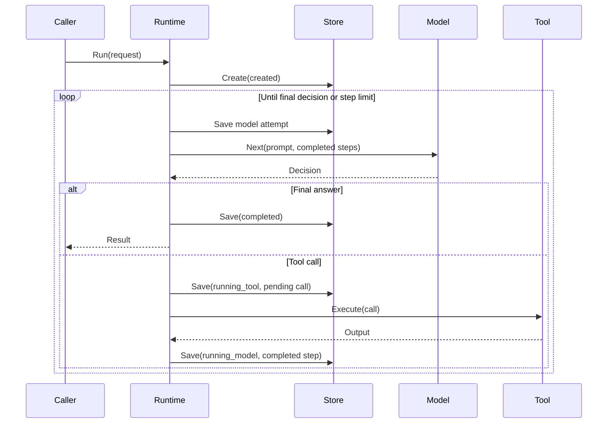

# Agent Harness Runtime

English | [简体中文](README-zh-CN/translation.md)

This repository is a teaching and proof-of-concept project. It is not a
production Agent platform.

The small runtime demonstrates model decisions, tool calls, durable recovery
boundaries, and terminal outcomes. It focuses on the lifecycle between an Agent
API and lower-level tool infrastructure.

The project keeps model providers, sandbox backends, MCP transports, schedulers,
and application orchestration outside the core state machine.

## Status

The v0.1 runtime scope is complete on `main`: deterministic model/tool execution, cancellation semantics, durable checkpoints, safe recovery, local execution locking, Sandbox and MCP tool adapters, execution observability hooks, and a runnable Sandbox dogfood example.

v0.2 adds a small OpenAI-compatible chat-completions `Model` adapter, a runnable DeepSeek -> Harness -> Sandbox -> Docker dogfood path, deterministic execution evals, durable execution traces and lifecycle diffs, callback deadlines, bounded durable model retries, and optional pending-tool reconciliation without changing the Harness state-machine shape.

The default runtime remains in memory unless a checkpoint store is configured. Recovery is explicit and conservative: uncertain external tool outcomes are never replayed automatically, while a tool adapter may prove a prior call completed through an optional reconciliation capability.

## v0.1 guarantee matrix

| Capability | v0.1 guarantee |
| --- | --- |
| Explicit execution lifecycle | Supported and transition-validated |
| Deterministic model -> tool -> model loop | Supported |
| Stable tool-call identity | Supported; completed IDs cannot be reused |
| Bounded model-attempt budget | Supported; default 16 attempts |
| Cancellation after callbacks | Cancellation wins; late successful callback output is not committed |
| Versioned checkpoints | Supported; current schema version is 3 |
| Durable model-attempt reservation | Supported before each model callback |
| Local crash recovery | Supported from safe checkpoint states |
| Completed-tool replay on recovery | Refused; completed results are reused |
| Pending-tool recovery | Fail closed unless `ToolOutcomeReconciler` proves the original call completed |
| Local single-execution ownership | Supported through `ExecutionLocker`; `FileStore` uses Linux `flock` |
| Sandbox tool adapter | Supported through `Agent-Sandbox-Runtime` v0.1.0 |
| MCP tool adapter | Supported through the official MCP Go SDK |
| Execution observability hooks | Supported; best-effort and isolated from control flow |
| Runnable end-to-end Sandbox example | Supported under `examples/sandbox-agent` |
| Exactly-once external tool effects | Not claimed |
| Automatic tool replay | Not included |
| Read-only tool outcome reconciliation | Optional capability on `ToolExecutor` |
| Distributed leases / network-filesystem coordination | Not included |
| Scheduler / queue / worker runtime | Not included |
| Multi-agent orchestration | Not included |
| Built-in real LLM provider | Not included |

## Execution model

```text
created
   |
   v
running_model ---------------------> completed
   |
   | tool_call
   v
running_tool
   |
   +-----------------> running_model

running_model / running_tool
   |             |
   +--> failed   +--> cancelled
```

### Execution sequence



Transitions are explicit and validated. Terminal states do not transition further.

A model step returns one of two decisions:

- `final`: terminate successfully with output
- `tool_call`: dispatch one identified tool call, capture its result, then return that structured step to the next model invocation

Tool calls require a stable call ID that is unique within the execution. Reusing a completed call ID fails with `ErrDuplicateToolCall` before dispatch, even if its arguments changed. The runtime records completed tool steps and the full transition sequence in the returned result.

## Core API

```go
runtime, err := harness.New(model, tools)
if err != nil {
    panic(err)
}

result, err := runtime.Run(ctx, harness.Request{
    Prompt: "inspect this repository",
})
```

The default execution limit is 16 model attempts. `WithMaxSteps` can lower or raise it. Exhausting the saved budget fails closed with `ErrStepLimitExceeded`.

Context cancellation produces the explicit `cancelled` terminal state. The runtime checks cancellation both before and immediately after model/tool callbacks, so successful callback output produced after cancellation is not committed to execution history or final output. Model errors, tool errors, invalid model decisions, and step-limit exhaustion produce `failed`.

## OpenAI-compatible Model adapter

`OpenAICompatibleModel` adapts a non-streaming `/chat/completions` endpoint to the Harness `Model` contract. It uses only the Go standard library and works with providers that implement the OpenAI chat-completions tool-call shape, including DeepSeek.

```go
model, err := harness.NewOpenAICompatibleModel(harness.OpenAICompatibleModelConfig{
    BaseURL: "https://api.deepseek.com",
    APIKey:  os.Getenv("DEEPSEEK_API_KEY"),
    Model:   "deepseek-v4-pro",
    Tools: []harness.OpenAIToolDefinition{{
        Name:        "shell",
        Description: "Run one sandboxed shell command.",
        Parameters:  json.RawMessage(`{"type":"object","properties":{"command":{"type":"string"}},"required":["command"]}`),
    }},
})
```

The adapter reconstructs completed Harness steps as `assistant tool_call -> tool result` messages on every model attempt. Provider tool-call IDs and argument strings are preserved unchanged so checkpoint, duplicate-call, and resolver semantics remain owned by the existing runtime/tool layers.

The v0.2 boundary is intentionally narrow:

- exactly one tool call is accepted per model attempt; multiple tool calls fail closed with `ErrModelResponse`
- non-`stop` terminal reasons such as token-limit truncation are not committed as final answers
- provider HTTP failures are classifiable with `ErrModelProvider` and expose status through `ModelProviderHTTPError`
- context cancellation propagates through the HTTP request
- API keys require an HTTPS endpoint, are sent only as bearer authorization headers, and are never stored in checkpoints
- credentialed requests do not follow HTTP redirects, preventing bearer tokens from being forwarded or downgraded
- `ExtraBody` can add provider-specific top-level request fields, but cannot override `model`, `messages`, `tools`, or `stream`
- streaming, provider registries, adapter-owned retries/backoff, token accounting, and provider response extensions are not included

## Model retries

Automatic model retry is disabled by default. `WithModelRetry` enables a bounded retry budget for transient model failures:

```go
runtime, err := harness.New(
    model,
    tools,
    harness.WithMaxSteps(16),
    harness.WithModelRetry(harness.ModelRetryPolicy{
        MaxRetries: 2,
        Delay:      250 * time.Millisecond,
    }),
)
```

Retries are limited to model callbacks. Tool callbacks are never retried automatically because a failed or timed-out tool may already have produced an external side effect.

### Why tool calls are not retried

Consider a `charge_payment` tool call with ID `payment-42`:

1. The Harness saves `payment-42` as the pending tool call.
2. The payment service charges the customer $10.
3. The service sends a successful response.
4. The network connection fails before the Harness receives that response.
5. The Harness sees a timeout, but the customer has already paid.

An automatic retry could charge the customer another $10. The timeout only
proves that the Harness did not receive a result. It does not prove that the
tool produced no effect.

The Harness therefore keeps `payment-42` pending and does not execute it again.
On recovery, a `ToolOutcomeReconciler` can query the payment service by call ID.
The execution continues only if that query proves the first charge completed.
An unknown outcome returns `ErrToolOutcomeUnknown` and stops recovery.

This rule also applies to email, file creation, deployment, and message sending.
Each operation can complete before its response becomes unavailable.

The built-in classifier retries `ErrModelTimeout`, generic provider transport failures, and provider HTTP 408/429/500/502/503/504. `ErrModelResponse`, caller cancellation, and other model errors fail immediately.

Every retry consumes the ordinary `MaxSteps` model-attempt budget. The retry budget is also persisted independently so a crash/restart cannot reset already acknowledged automatic retries. See [MODEL_RETRIES.md](MODEL_RETRIES.md) for the durable accounting and recovery boundary.

## Durable checkpoints

```go
store, err := harness.NewFileStore("./checkpoints")
if err != nil {
    panic(err)
}

runtime, err := harness.New(
    model,
    tools,
    harness.WithCheckpointStore(store),
)
if err != nil {
    panic(err)
}

result, err := runtime.Run(ctx, harness.Request{
    ExecutionID: "research-001",
    Prompt:      "inspect this repository",
})
```

`WithCheckpointStore` requires a nonempty caller-owned `ExecutionID`. `Run` creates the initial record atomically and rejects an existing ID with `ErrExecutionExists` before invoking model or tool callbacks.

Schema version 3 records the request, original step budget, reserved model-attempt count, configured/consumed automatic model-retry budget, current result, transition history, completed tool steps, any pending tool call, and diagnostic terminal error text.

| Save boundary | Recorded state |
| --- | --- |
| Execution creation | `created`, request and budgets |
| Before every model callback | `running_model`, incremented reserved model-attempt count |
| After a retryable model failure | `running_model`, incremented durable model-retry count |
| Before each tool callback | `running_tool`, full pending tool call |
| After accepted or externally reconciled tool result | `running_model`, completed step, pending call cleared |
| Terminal return | `completed`, `failed`, or `cancelled` |

A checkpoint write must succeed before the next callback starts. Store failures stop execution with `ErrCheckpointStore`; the returned result represents the last acknowledged snapshot. Terminal writes use a separate bounded context so an already-cancelled execution can still attempt to persist its cancellation state.

`FileStore` is designed for trusted local Linux filesystems. It uses atomic file publication, file/directory sync, restrictive file permissions, hashed execution filenames, and per-execution advisory `flock` ownership. Distributed leases and network-filesystem coordination are outside the v0.1 guarantee.

## Recovery

A new process can open the same store, construct compatible adapters, and explicitly resume an execution:

```go
result, err := runtime.Resume(ctx, "research-001")
```

`Resume` uses the saved request, tool history, original model-attempt budget, and saved automatic model-retry budget. A new runtime configuration cannot reset those persisted budgets. Interrupted model attempts may be invoked again and may therefore be billed again; crash recovery is separate from automatic retry accounting.

| Saved state | Resume behavior |
| --- | --- |
| `created` | Start the model loop using the saved request and budgets |
| `running_model` | Continue using saved tool results; reserve a new model attempt |
| `running_tool` | Ask optional `ToolOutcomeReconciler`; continue only when it proves completed, otherwise return `ErrToolOutcomeUnknown` |
| `completed` | Return the saved result without callbacks or checkpoint writes |
| `failed` / `cancelled` | Return the saved result with `ErrExecutionTerminal` |

Completed tools are reused from checkpoint history and never dispatched again. A pending tool call records durable intent only; the external action may already have happened even when its result was never saved. The runtime never re-executes that call automatically. If the `ToolExecutor` also implements `ToolOutcomeReconciler`, `Resume` may query external state and accept only a proven completed result. Unknown outcomes still fail closed with `ErrToolOutcomeUnknown`.

A reconciled completion is converted into the ordinary completed `Step`, persisted with `running_tool -> running_model`, and saved before another model callback runs. Reconciliation itself must be read-only; it is safe to repeat if a checkpoint write fails. See [TOOL_RECONCILIATION.md](TOOL_RECONCILIATION.md) for the contract and failure boundaries.

Schema version 2 records remain resumable and retain their original behavior with automatic model retries disabled. Schema version 1 records remain readable; terminal v1 records can be inspected/returned, while active v1 recovery returns `ErrRecoveryUnsupported` because those records did not durably reserve interrupted model attempts.

## Sandbox ToolExecutor

`SandboxToolExecutor` adapts the Harness `ToolExecutor` contract to `github.com/luojiyin1987/Agent-Sandbox-Runtime` v0.1.0.

A caller-provided `SandboxRequestResolver` maps an Agent-facing `ToolCall` to one `sandbox.ExecRequest`. The Harness core does not interpret shell syntax, workspace policy, Docker, or gVisor configuration.

The adapter preserves the Sandbox Runtime contract:

- invalid resolved requests fail before sandbox dispatch
- sandbox runtime errors fail the Harness tool step while preserving error identity
- non-zero workload exit codes remain completed tool results when the Sandbox Runtime returns no Go error
- stable model-facing JSON includes exit code, stdout, stderr, truncation state, and termination reason

## MCP ToolExecutor

`MCPToolExecutor` adapts the Harness `ToolExecutor` contract to an already-established MCP caller using the official MCP Go SDK.

The adapter keeps protocol/transport lifecycle outside the Harness core:

- a `CallTool` Go error fails the Harness tool step
- `CallToolResult.IsError=true` is returned to the next model invocation as a tool-level result so the model can self-correct
- unresolved `input_required` state is refused with `ErrMCPInputRequired`
- stdio/HTTP transport setup, authentication, server discovery, reconnects, and MCP session ownership remain caller concerns

## Observability

`WithObserver` installs one synchronous, best-effort observer for execution boundaries:

```text
execution_started
model_started
model_completed
tool_started
tool_completed
execution_completed | execution_failed | execution_cancelled
```

Events expose execution ID, lifecycle state, model-attempt number, tool identity, callback/execution duration, and callback/terminal errors where relevant.

Observer delivery is not part of checkpoint or execution correctness. Observer panics are recovered and cannot change the Harness result. Callback duration measures the model/tool callback itself rather than synchronous `*_started` observer latency.

The observability layer has no OpenTelemetry, Prometheus, exporter, buffering, retry, or sampling dependency. Those can be implemented as observers outside the control plane.

## End-to-end dogfood

The repository includes a runnable integration example:

```sh
go run ./examples/sandbox-agent
```

It exercises the real path:

```text
deterministic local model
        |
        v
Agent-Harness-Runtime
        |
        v
SandboxToolExecutor
        |
        v
Agent-Sandbox-Runtime
        |
        v
Docker backend -> fresh Alpine container
```

The first model step emits a `shell` tool call. The Sandbox Runtime executes it under its default fail-closed policies, the Harness feeds the stable tool result into the second model step, and the model returns the final answer. The example also prints the execution events provided by the observer API.

Running the Docker workload is an explicit local integration action; ordinary Harness CI compiles the example but does not require Docker.

### DeepSeek + Sandbox dogfood

A second example replaces the deterministic model with the real OpenAI-compatible DeepSeek adapter:

```sh
DEEPSEEK_API_KEY=... go run ./examples/deepseek-sandbox-agent
```

Optional overrides:

```sh
DEEPSEEK_BASE_URL=https://api.deepseek.com \
DEEPSEEK_MODEL=deepseek-v4-flash \
DEEPSEEK_API_KEY=... \
go run ./examples/deepseek-sandbox-agent
```

The example exercises:

```text
DeepSeek V4
    |
    v
OpenAICompatibleModel
    |
    v
Agent-Harness-Runtime
    |
    +--> durable FileStore checkpoints
    |
    +--> execution Observer events
    |
    v
SandboxToolExecutor
    |
    v
Agent-Sandbox-Runtime
    |
    v
Docker -> fresh Alpine container
```

DeepSeek V4 currently enables thinking mode by default. For tool-calling conversations, DeepSeek requires prior `reasoning_content` to be replayed on subsequent requests when thinking is enabled. The Harness checkpoint schema intentionally does not persist provider-private reasoning state, so this dogfood config uses `ExtraBody` to send `{"thinking":{"type":"disabled"}}`. That keeps the example inside the existing durable Harness contract rather than adding DeepSeek-specific chain-of-thought state to checkpoints.

The probe exposes only one `shell` tool and the resolver accepts one exact fixed command. The sandbox receives no writable host workspace or outbound network configuration from the example. A successful run must produce exactly one completed tool step, the expected sandbox stdout, a completed final answer, and a reloadable completed checkpoint.

Running this path is explicit because it consumes a real DeepSeek API call and requires Docker. CI compiles the example and tests the request-extension plumbing without requiring credentials or external network access.

## Execution evals

`TestExecutionEvalSuite` adds a deterministic acceptance layer above the focused unit tests. It runs complete Harness executions and scores terminal status, error identity, committed tool effects, step count, and ordered observer traces.

```sh
go test -race -run TestExecutionEvalSuite -v .
```

Current cases cover direct final output, one allowed tool round trip, unauthorized tool rejection without a side effect, duplicate completed tool-call identity without redispatch, and bounded termination of a runaway tool loop.

See [EVALS.md](EVALS.md) for the scorecard and the boundary between deterministic runtime evals and the live DeepSeek dogfood.

## Boundary and non-goals

v0.1 intentionally stops at the reusable Harness/Runtime boundary. It does not claim:

- exactly-once tool execution or external side-effect transactions
- automatic replay or assumed completion of uncertain tool outcomes
- distributed execution ownership or leases
- queues, workers, cron, or scheduling
- multi-agent orchestration
- memory/RAG or application-specific Agent state
- built-in LLM provider integrations
- ownership of Sandbox Docker/gVisor configuration
- ownership of MCP connection/authentication/transport lifecycle

The project should remain focused on lifecycle semantics, recovery boundaries, adapter contracts, and execution evidence rather than growing into an application framework.

## Development

Requires Go 1.26 or newer.

```sh
gofmt -w .
go vet ./...
go test -race ./...
```

For the deterministic Sandbox dogfood path, Docker must also be available locally:

```sh
go run ./examples/sandbox-agent
```

For the real DeepSeek + Sandbox path:

```sh
DEEPSEEK_API_KEY=... go run ./examples/deepseek-sandbox-agent
```
